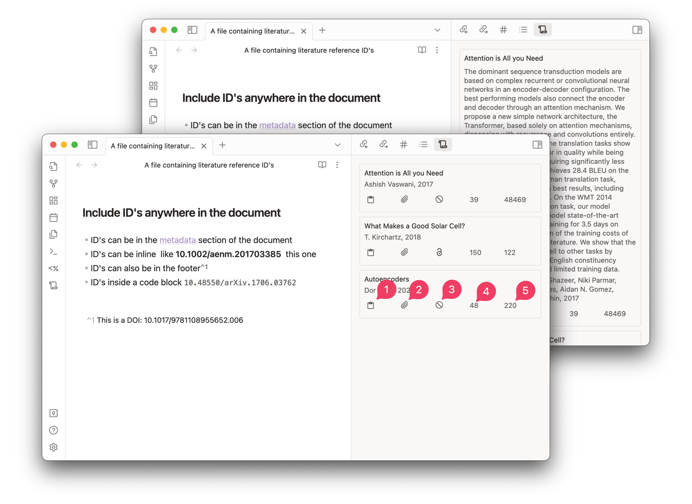

# Reference Map
Reference and citation map for literature review and discovery. 

## Requirements
- [Obsidian](https://obsidian.md/) with community plugins enabled

## Installation
The plugin is not available in the community plugin section in Obsidian. So you have to install it manually.

### Manual Installation
1. Download the latest release from [here](https://github.com/anoopkcn/obsidian-reference-map/releases) and unzip it.
2. Copy the `obsidian-reference-map` folder to your vault's `.obsidian/plugins` folder.
3. Reload Obsidian.
4. Enable the plugin in the community plugins section.

You can also use the [BRAT](https://github.com/TfTHacker/obsidian42-brat/) plugin to install the latest release.

## Usage


### Reference Map View
Reference Map View contains Reference Cards.

Each reference card in the view will show the following information:
| Section | Description | On Click |
| --- | --- | --- |
| Title | Title of the paper | Open the paper in [Semantic Scholar](https://www.semanticscholar.org/) |
| Authors | Authors of the paper | Open the author's details in [Semantic Scholar](https://www.semanticscholar.org/) |
| Year | Year of publication | |
| Abstract | Abstract of the paper |  |
| BibTex | BibTex of the paper | Copy the BibTex to the clipboard |
| Metadata | Metadata of the paper | Copy the metadata to the clipboard |
| PDF | Open Access PDF of the paper | Open the [Open Access](https://de.wikipedia.org/wiki/Open_Access) PDF of the paper if it is present for a reference |
| Reference count | Number of references | Open a searchable list of all cited papers (References) |
| Citation count | Number of citations | Open a searchable list of all citing papers (Citations) |
| Influential citation count | [Number of influential citations](https://www.semanticscholar.org/paper/Identifying-Meaningful-Citations-Valenzuela-Ha/1c7be3fc28296a97607d426f9168ad4836407e4b) |  |

### Static Reference List
Reference IDs(DOI, corpusID, URL, citeKey, etc,.) that are found in the current document are listed in the `Reference Map` view. Valid IDs can be added anywhere in the document and they will be detected.

The following types of IDs are supported:
| Syntax| Descrtipion | Example |
| --- | --- | --- |
`DOI:<doi>`| A [Digital Object Identifier](http://doi.org/). |`DOI:10.18653/v1/N18-3011` or `10.18653/v1/N18-3011v1`
`CorpusId:<id>`| Semantic Scholar numerical ID|`CorpusId:215416146`
`ARXIV:<id>`| [arXiv.org](https://arxiv.org/)|`ARXIV:2106.15928`
`MAG:<id>`| Microsoft Academic Graph|`MAG:112218234`
`PMID:<id>`| PubMed/Medline|`PMID:19872477`
`PMCID:<id>`| PubMed Central|`PMCID:2323736`
`URL:<url>`| URL from sites|`URL:https://arxiv.org/abs/2106.15928v1`
`@<citekey>`| [Zotero](https://www.zotero.org/) citekey*|`@smith2019attention`

*Enable this feature from the settings. Note that, one has to provide a `BiBTeX CSL JSON` file to enable this feature. Once enabled, the plugin can recogonize the pandoc citation format.
 

### Dynamic Reference List
The Reference Map view can also be configured to show a list of references that correspond to the filename of the note or frontmatter keywords. Check out the settings tab to configure the plugin behaviour.

**Example:** For a file named `Attention is all you need.md`  cards will be displayed for references that match "Attention+all+need". 

For frontmatter keywords, you can configure a keyword to be used for reference search.  By default, the keyword is `keywords`.

**Example:** For a frontmatter given as follows:
```
---
keywords: autoencoders, machine learning
---
```
Cards will be displayed for references that match "autoencoders+machine+learning".

Note that since new references are added to the database regularly the dynamic list might not stay the same each time you open the file. Especially for generic keywords like "machine learning", "deep learning", "history" etc.

**This feature can be used for keeping up to date with the latest research in a specific field as well**


## Configuration 
    
If you want to configure the style of the view you can use the [Obsidian-style-settings](https://github.com/mgmeyers/obsidian-style-settings) plugin.

The settings tab contains options to configure the behaviour of the plugin.

### Please feel free to open an issue if you find any bugs or have any suggestions.