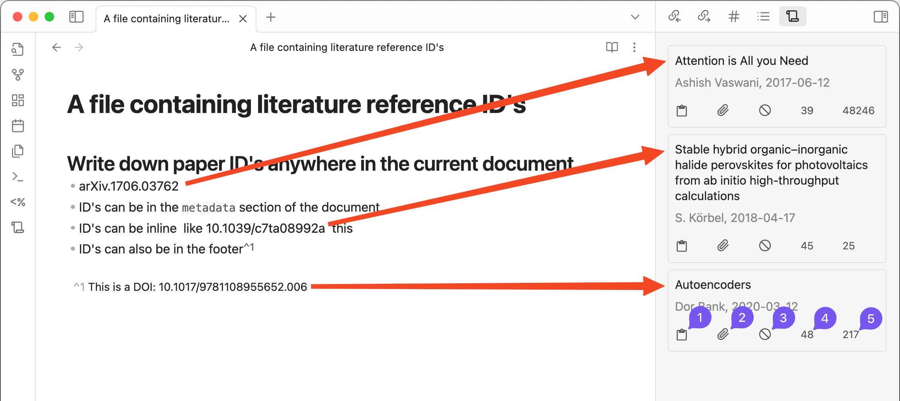
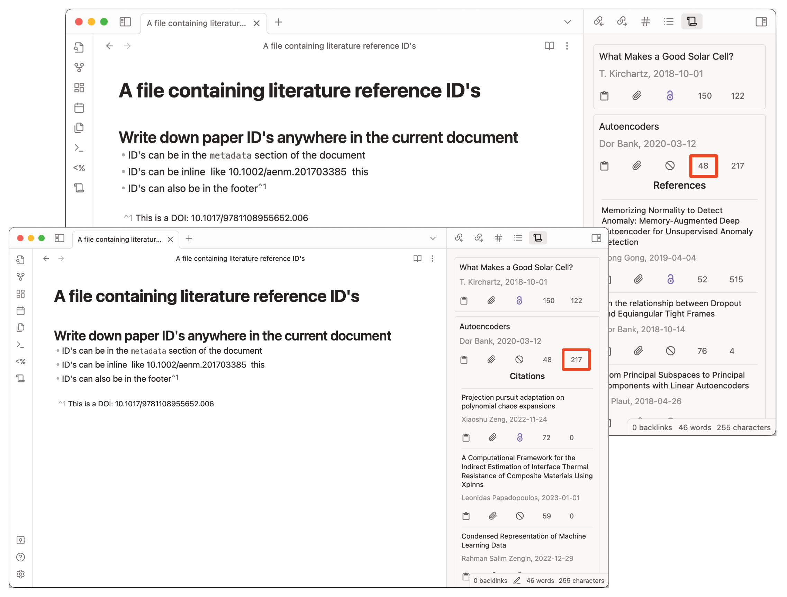

# Reference Map
Reference and citation map for literature review and discovery. 

## Requirements
- [Obsidian](https://obsidian.md/) with community plugins enabled

## Installation
The plugin is not available in the community plugin section in Obsidian. So you have to install it manually.

### Manual Installation
1. Download the latest release from [here](https://github.com/anoopkcn/obsidian-reference-map/releases) and unzip it.
2. Copy the `obsidian-reference-map` folder to your vault's `.obsidian/plugins` folder.
3. Reload Obsidian.

You can also use the [BRAT](https://github.com/TfTHacker/obsidian42-brat/) plugin to install the latest release.

## Features
Identifies research literature ID's from the current document and displays a map of references and citations. The map can be used to navigate to the references and citations.

## Paper ID's can be the following:
The following types of IDs are supported:
-   `CorpusId:<id>` - Semantic Scholar numerical ID, e.g. `215416146`
-   `DOI:<doi>` - a [Digital Object Identifier](http://doi.org/), e.g. `DOI:10.18653/v1/N18-3011`
-   `ARXIV:<id>` - [arXiv.rg](https://arxiv.org/), e.g. `ARXIV:2106.15928`
-   `MAG:<id>` - Microsoft Academic Graph, e.g. `MAG:112218234`
-   `ACL:<id>` - Association for Computational Linguistics, e.g. `ACL:W12-3903`
-   `PMID:<id>` - PubMed/Medline, e.g. `PMID:19872477`
-   `PMCID:<id>` - PubMed Central, e.g. `PMCID:2323736`
-   `URL:<url>` - URL from one of the sites listed below, e.g. `URL:https://arxiv.org/abs/2106.15928v1`

